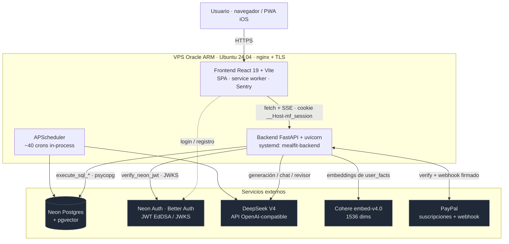
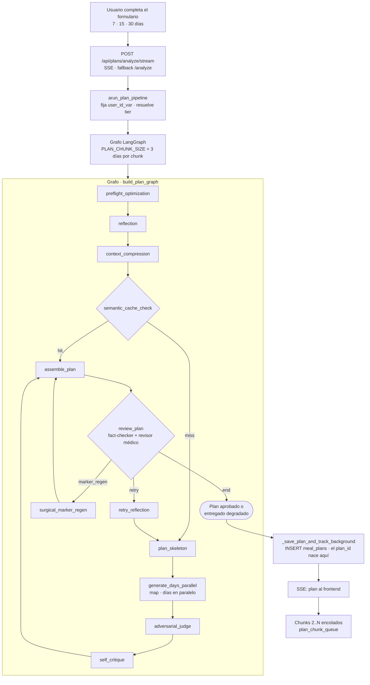
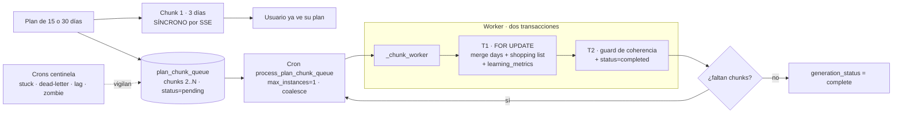
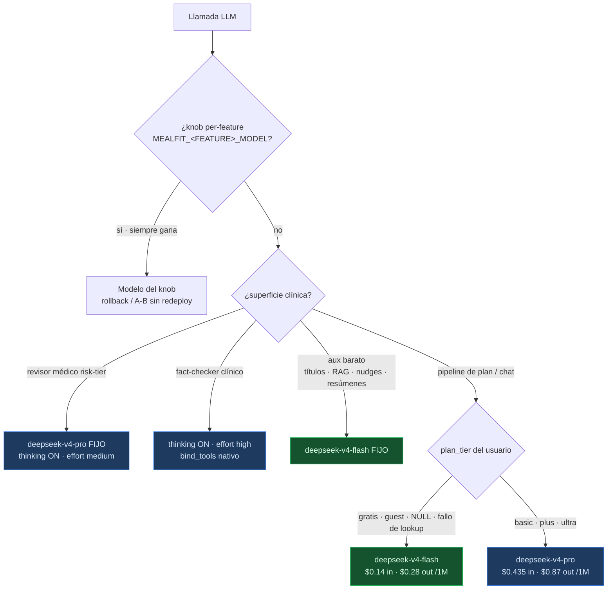
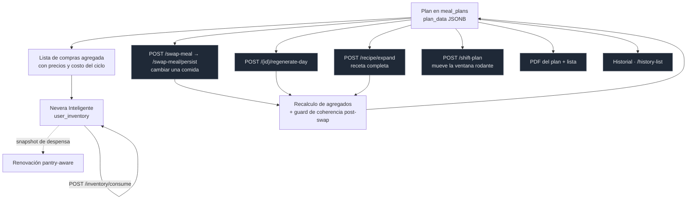
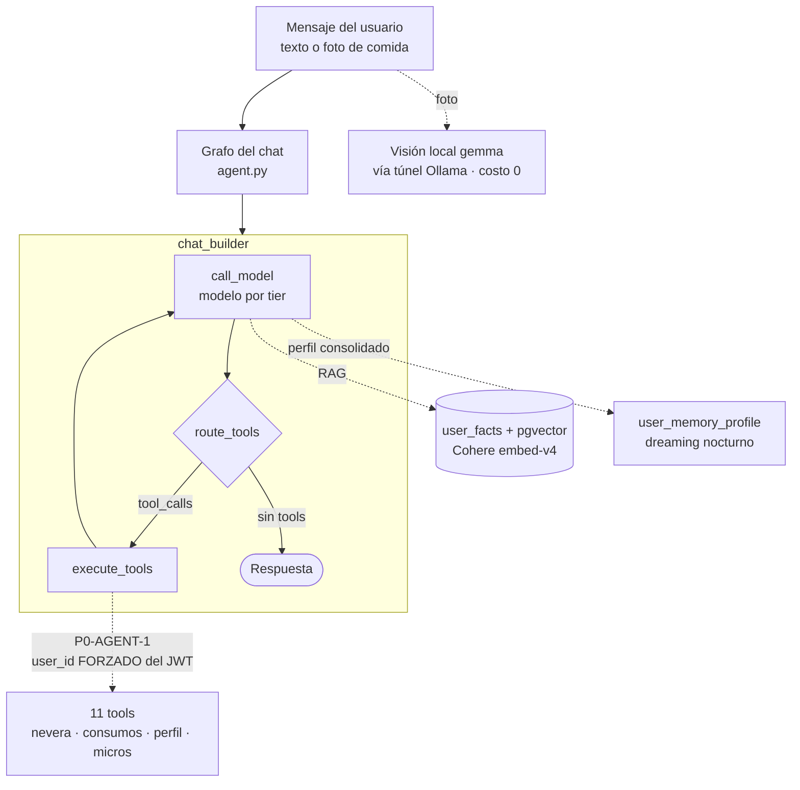
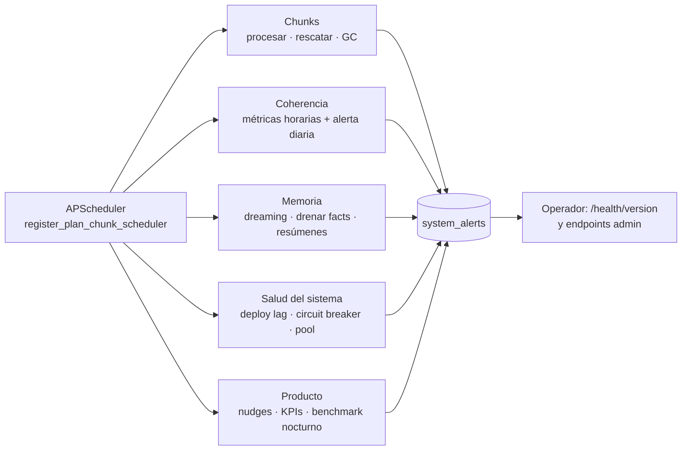

# Cómo funciona MealfitRD — diagramas del sistema

[SYSTEM-OVERVIEW · 2026-07-24] Vista de conjunto derivada del **código en HEAD**, no de
memoria. Cada diagrama cita los archivos que lo respaldan para poder re-verificarlo.

Docs relacionadas: [`llm_tier_routing.md`](llm_tier_routing.md) (routing/pricing),
[`coherence_surfaces_table.md`](coherence_surfaces_table.md) (guard de coherencia),
[`agent_tools_user_id_table.md`](agent_tools_user_id_table.md) (tools del chat),
[`dreaming_consolidation.md`](dreaming_consolidation.md) (memoria offline).

---

## 1. Vista general

**Reglas duras del borde** — el backend es la única frontera de confianza:
`auth.py::get_verified_user_id` valida firma server-side (P0-AUDIT-1), toda mutación
filtra `AND user_id = %s` (invariante I2), y el frontend **no escribe** a `meal_plans`
(invariante I6: solo endpoints con `jsonb_set` quirúrgico).

---

## 2. Generación de un plan — de la solicitud a la entrega

- `assemble_plan` construye `aggregated_shopping_list` y corre el **guard de coherencia**
  recetas ↔ lista; `review_plan` es quien lo consume y puede forzar retry.
- Si el revisor rechaza y se agota el presupuesto, el plan **se entrega igual** marcado
  `review_passed=False` → alert `plan_quality_degraded:<user>:<plan>` (invariante I5).
- Fuentes: [`graph_orchestrator.py::build_plan_graph`](../graph_orchestrator.py),
  [`services.py`](../services.py), [`constants.py`](../constants.py).

---

## 3. Planes largos: chunking en segundo plano

Estados canónicos de `plan_chunk_queue.status` y sus transiciones viven en
[`cron_tasks.py`](../cron_tasks.py) (state-machine documentada en
`process_plan_chunk_queue`). El CHECK de DB `meal_plans_complete_requires_days`
(invariante I8) impide marcar `complete` con `days = 0`.

---

## 4. Qué modelo se usa y cuándo

Dos invariantes que este diagrama codifica:

- **fail-cheap**: cualquier duda (guest, blip de DB, tier corrupto) resuelve a FLASH —
  un fallo de lookup jamás encarece la llamada.
- **la seguridad clínica no se degrada por plan de pago**: el revisor médico de riesgo
  va a PRO para *todos* los tiers, incluido el gratis.

El *thinking mode* nativo de V4 está **OFF global** y se re-activa solo en superficies de
juicio con output chico; en generación grande revienta el timeout. Detalle y mediciones
A/B: [`llm_tier_routing.md`](llm_tier_routing.md).

---

## 5. Vida del plan después de entregado

Todas esas flechas son **endpoints backend**: el cliente nunca escribe `plan_data`
(invariante I6). Las escrituras full-overwrite van bajo advisory lock o
`update_plan_data_atomic` (`SELECT … FOR UPDATE` + callback) para cerrar la ventana
lost-update (invariante I7).

Los endpoints de mantenimiento (`/restock`, `/inventory/consume`, `/shift-plan`,
`/recalculate-shopping-list`, historial) están **exentos del paywall** a propósito: cero
costo LLM, y cobrarlos congelaba funciones de un plan ya pagado. Se protegen con
`RateLimiter` por bucket, no con el cap mensual.

---

## 6. Chat del agente

El override de `user_id` en `execute_tools` es la defensa central: el modelo **recibe**
el `user_id` en el prompt, pero eso es *prompt-trustable, no enforced* — una inyección
podría emitir un `tool_call` con identidad ajena, así que el nodo lo sobrescribe con el
valor autenticado antes de invocar cualquier tool.

---

## 7. Trabajo de fondo (crons)

Una alert "vive" mientras `resolved_at IS NULL`; el catálogo completo de ~32 `alert_key`
con su productor y su modelo de resolución está en
[`system_alerts_resolution_table.md`](system_alerts_resolution_table.md).

---

## Cómo re-verificar este documento

| Diagrama | Fuente de verdad |
|---|---|
| 2 · grafo | `grep -n "add_node\|add_edge\|add_conditional_edges" backend/graph_orchestrator.py` |
| 3 · chunking | `PLAN_CHUNK_SIZE` en [`constants.py`](../constants.py) + `_chunk_worker` en [`cron_tasks.py`](../cron_tasks.py) |
| 4 · modelos | [`llm_provider.py`](../llm_provider.py) (`DEEPSEEK_FLASH` / `DEEPSEEK_PRO`) + [`llm_tier_routing.md`](llm_tier_routing.md) |
| 5 · endpoints | `grep -n "@router.post\|@router.get" backend/routers/plans.py` |
| 6 · chat | `chat_builder` al final de [`agent.py`](../agent.py) |
| 7 · crons | `grep -on "id=[\"'][a-z0-9_]*[\"']" backend/cron_tasks.py` |
